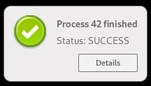

# Go-Notification

Go package for sending [Desktop Notifications](https://people.gnome.org/~mccann/docs/notification-spec/notification-spec-latest.html) and handling *NotificationClosed* and *ActionInvoked* signals.

For more information see the [documentation](https://pkg.go.dev/github.com/andreas19/go-notification/notification).

## Handler functions

The functions for handling signals will be executed as *goroutines*.

## Example

An application monitors some processes and informs the user with a desktop notification
when one has finished. The user can click on an action button in the notification to
open a page in a web browser to see more details.

```go
package main

import (
	"fmt"

	"github.com/andreas19/go-notification/notification"
)

func openPage(proc_id int) {
	url := fmt.Sprintf("http://localhost/details&proc_id=%d", proc_id)
	// open page with the given url in a web browser
}

func notify(proc_id int, ok bool) {
	var icon, status string
	var urgency notification.Urgency
	if ok {
		icon = "icons/icon.png"
		status = "SUCCESS"
		urgency = notification.UrgencyNormal
	} else {
		icon = "icons/error.png"
		status = "ERROR"
		urgency = notification.UrgencyCritical
	}
	noti := notification.New(fmt.Sprintf("Process %d finished", proc_id), "Status: " + status)
	noti.SetIcon(icon)
	noti.SetUrgency(urgency)
	noti.AddActionHandler("details", "Details", func() {
		openPage(proc_id)
	})
	notification.Notify(noti)
}

func main() {
	err := notification.Init("Example App", "")
	if err != nil {
		panic(err)
	}
	// start monitoring processes
}

// a process has just finished and the details are stored somewhere so
// they can be retrieved for the web page

notify(42, true)
```


